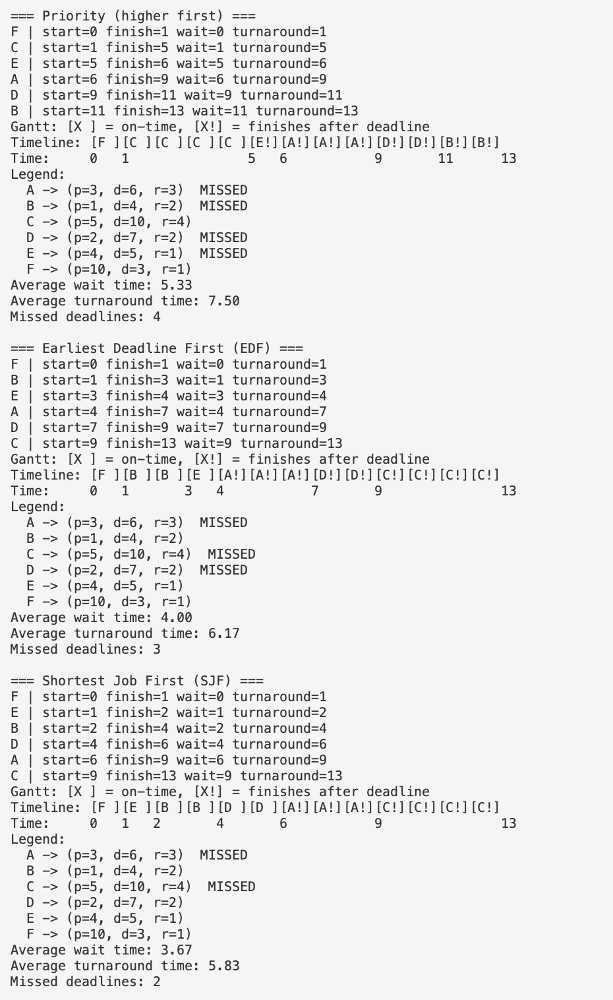

# Smart Task Scheduler (Java)

A Java-based task scheduling simulator comparing Priority, Earliest Deadline First (EDF), and Shortest Job First (SJF) scheduling algorithms using real performance metrics, visual timelines, and multi-seed benchmarking.

This project focuses on algorithmic tradeoffs, systems thinking, and measured evaluation similar to operating system schedulers and real-world job dispatchers.

---

## Features

- Implements three scheduling algorithms:
  - Priority Scheduling
  - Earliest Deadline First (EDF)
  - Shortest Job First (SJF)
- CSV-based task input
- Per-task metrics:
  - Start time
  - Finish time
  - Wait time
  - Turnaround time
- Gantt-style terminal visualization with deadline indicators:
  - [X ] finishes on time
  - [X!] finishes after deadline
- Benchmarking framework with:
  - Average wait time
  - Average turnaround time
  - Missed deadlines
  - Deadline miss rate percentage
- Multi-seed benchmark study using mean and standard deviation
  - Numerical stability via Welford’s algorithm

---

## Project Structure

src/
  model/        Task data model
  scheduler/    Priority, EDF, SJF implementations
  metrics/      Metric calculations
  io/           CSV task loader
  simulation/   Simulator, Gantt printer, benchmarking tools
data/
  tasks.csv     Example task input
results/
  benchmark_1000_tasks_20_seeds.txt
  gantt_output.png

---

## Build and Run

Compile the project:

javac -d out $(find src -name "*.java")

Run with CSV input:

java -cp out Main data/tasks.csv

Run benchmark study with multiple seeds:

java -cp out Main --benchmark 1000 --seeds 20

---

## Visual Output (Gantt Chart)

---

## Benchmark Study

A multi-seed benchmark study was conducted using:
- 1000 tasks per trial
- 20 independent random seeds

Metrics evaluated:
- Average wait time
- Average turnaround time
- Missed deadlines
- Deadline miss rate

Full benchmark output:
results/benchmark_1000_tasks_20_seeds.txt

### Summary of Findings

- Shortest Job First consistently minimized average wait time and turnaround time
- Shortest Job First reduced missed deadlines compared to Priority and EDF
- Priority and EDF showed similar performance under the tested workload
- Results reflect classical scheduling tradeoffs between throughput and deadline guarantees

---

## Key Takeaways

This project demonstrates:
- Practical implementation of classical scheduling algorithms
- Quantitative performance evaluation instead of anecdotal comparison
- Terminal-based visualization for system-level reasoning
- Experimental rigor through multi-seed benchmarking

---

## Technologies Used

- Java
- Standard Java collections
- CSV file processing
- Terminal-based visualization
- Git and GitHub

---

## Author

Gabrielle Boyer-Baker  
Computer Science (Software Development)  
Neuroscience Minor  

---

## License

This project is for educational and portfolio purposes.

